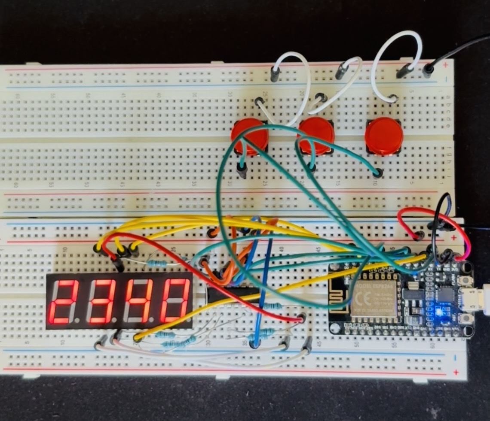

# Pomodoro Timer

A physical pomodoro timer with a 7-segment display, synced live over the internet to a web dashboard.




## What it does

- Physical device (ESP8266 + 4-digit 7-segment display) shows the live countdown
- Buttons on the device toggle the timer and reset work/break sessions
- A Go backend is the single source of truth for timer state and persists sessions to Postgres
- A React web app mirrors the device in real time and shows history and daily progress

## The interesting parts:

Two clients (a microcontroller and a browser) can both start, pause, and reset the same countdown, and either one can drop off the network at any moment. For example, the WiFi connection drops, a laptop enters sleep mode, or the Cloudflare tunnel goes down. The question is how they stay in agreement without either one drifting from the true time.

The backend is the only source of truth. It never broadcasts a live decrementing number, only `{ status, end_time, session_id }`. Every client, device or browser, computes remaining time as `end_time - now` against its own network time protocol synced clock. That has two effects: display drift can't accumulate between updates, and reconnecting after a drop is just "ask the backend what's currently true" instead of reconciling two guesses. A button press on the physical device and an action in the web app follow the exact same path -> command in, backend updates truth, backend broadcasts -> so there's no special-casing by origin.

The tradeoffs behind that (and why WebSocket over MQTT, why Go, why one shared Postgres instance) are written up as ADRs in [docs/adr](docs/adr).

## Architecture:

Three units stay in sync because the backend owns the countdown and broadcasts state over WebSocket; every client derives remaining time rather than trusting a pushed number. See [docs/architecture.md](docs/architecture.md) for the full design.

- **Firmware (ESP8266):** executor and display only. Drives the 4-digit 7-segment display through a 74HC595 shift register (so the display doesn't eat every GPIO pin the board has), reads the three physical buttons, holds a WebSocket connection to the backend authenticated with a service token, and treats its own local countdown as a display cache, never authoritative.
- **Backend (Go):** the source of truth. Validates commands, computes `end_time`, broadcasts state changes, and persists finished sessions to Postgres. Runs on a home server behind a Cloudflare Tunnel.
- **Web app (React + TypeScript):** control surface and dashboard. Sends commands, mirrors the live state, and shows session history and daily progress. Sits behind Cloudflare Access.

## Tech stack:

Go · PostgreSQL · WebSocket · React + TypeScript · ESP8266 · Cloudflare Tunnels · Docker

## Hardware:

- ESP8266 WiFi development board (2A4RQ-ESP8266)
- 5461AS 4-digit 7-segment display, driven via a 74HC595 shift register
- 3 momentary push buttons (start/pause, reset work, reset break)

## Status:

Early development. The three units are scaffolded (firmware, backend + CI, web app) and the architecture and data model are settled with ADRs recorded; the WebSocket sync loop between them is the current work. Tracked on the [project board](https://github.com/users/apalecz2/projects/1/views/2).

## Repo layout:

```
firmware/   ESP8266 device code (PlatformIO)
backend/    Go WebSocket server + Postgres persistence
web/        React + TS control plane / dashboard
docs/       Architecture notes and ADRs
```