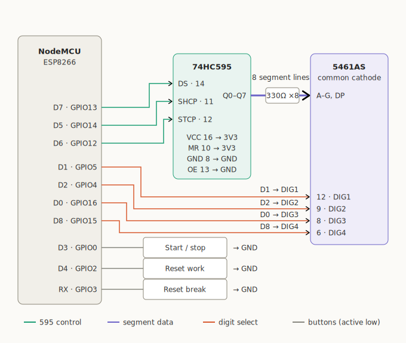
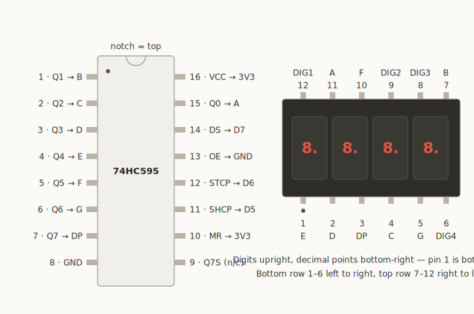
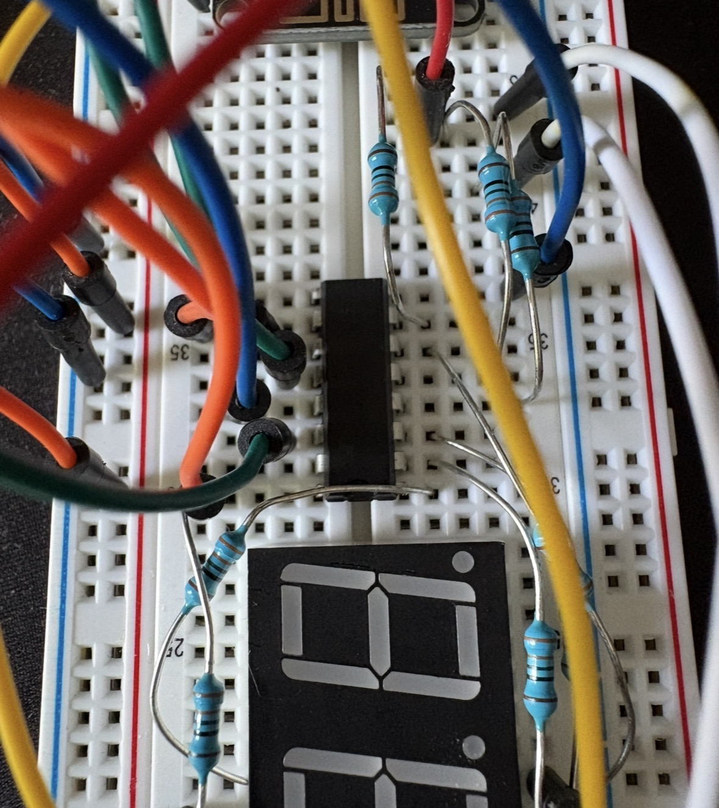
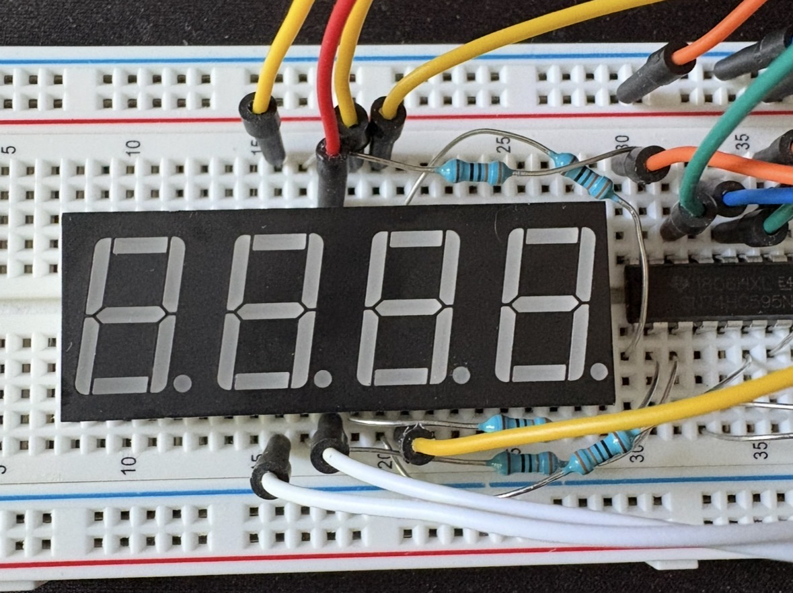
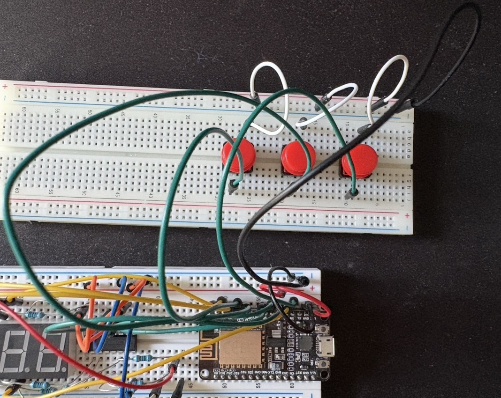

# Hardware Wiring

This document describes the verified, working wiring for the physical Pomodoro timer device: a NodeMCU ESP8266 driving a 5461AS 4-digit 7-segment display through a 74HC595 shift register, plus three control buttons. The design goal is a minimal GPIO footprint. The shift register owns all eight segment lines, so the ESP8266 spends only 3 pins on display data, 4 on digit multiplexing, and 3 on buttons.

The device is a display/executor client only. It renders `end_time − now` derived from backend state over websocket; it is not the source of truth (see the architecture doc).

## Bill of materials

| Qty | Part | Notes |
|----:|------|-------|
| 1 | NodeMCU ESP8266 dev board | FCC ID 2A4RQ-ESP8266, micro-USB powered |
| 1 | 5461AS | 4-digit 7-segment display, **common cathode**, 12-pin |
| 1 | 74HC595 | 8-bit shift register, DIP-16 |
| 8 | 330 Ω resistor | Segment current limiting |
| 3 | Tactile pushbutton | Start/stop, reset work, reset break |
| 1 | Breadboard + jumpers | 74HC595 straddles the center trench. I used 2 breadboards to leave plenty of space for the buttons, but that's not required. |

Everything runs from the NodeMCU's 3V3 rail. Nothing uses 5 V / Vin.

## System wiring diagram



## Pin identification

Both packages are identified by finding the orientation marker, then counting counterclockwise from pin 1 (viewed from above):

- **74HC595:** notch (and pin-1 dot) at the top -> pin 1 top-left, pins 1–8 down the left side, 9–16 up the right side.
- **5461AS:** no notch: orient by the decimal points. With digits upright and decimal points at the bottom-right, pin 1 is bottom-left; the bottom row runs 1–6 left to right, the top row runs 7–12 right to left.



> **Note:** this pin map is the standard 5461AS/5641AS layout and was verified on the actual part with a 3V3 + 330 Ω probe before wiring (see [Verification](#verification)). Clone displays occasionally differ: re-verify if substituting parts.

## Pin assignment

### NodeMCU -> 74HC595

| NodeMCU | GPIO | 74HC595 pin | Function |
|---------|------|-------------|----------|
| D7 | GPIO13 | 14 (DS) | Serial data (HSPI MOSI-capable) |
| D5 | GPIO14 | 11 (SHCP) | Shift clock (HSPI CLK-capable) |
| D6 | GPIO12 | 12 (STCP) | Latch |
| 3V3 | - | 16 (VCC), 10 (MR) | MR held high -> register never clears |
| GND | - | 8 (GND), 13 (OE) | OE held low -> outputs always enabled |

Pin 9 (Q7S) is left unconnected: it is only used for daisy-chaining a second register.

### 74HC595 -> 5461AS (segments)

Each line passes through one 330 Ω resistor. Q0–Q6 map to segments A–G in order, so the firmware font table is the standard 7-segment byte encoding (bit 0 = A ... bit 6 = G, bit 7 = DP).

| 74HC595 output | Resistor | 5461AS pin | Segment |
|----------------|----------|------------|---------|
| 15 (Q0) | 330 Ω | 11 | A |
| 1 (Q1) | 330 Ω | 7 | B |
| 2 (Q2) | 330 Ω | 4 | C |
| 3 (Q3) | 330 Ω | 2 | D |
| 4 (Q4) | 330 Ω | 1 | E |
| 5 (Q5) | 330 Ω | 10 | F |
| 6 (Q6) | 330 Ω | 5 | G |
| 7 (Q7) | 330 Ω | 3 | DP |

### NodeMCU -> 5461AS (digit select)

The display is common cathode: a digit is enabled by driving its cathode **LOW**. Digits are multiplexed one at a time (~2 ms each, ~125 Hz full-frame refresh).

| NodeMCU | GPIO | 5461AS pin | Digit |
|---------|------|------------|-------|
| D1 | GPIO5 | 12 | DIG1 (leftmost) |
| D2 | GPIO4 | 9 | DIG2 |
| D0 | GPIO16 | 8 | DIG3 |
| D8 | GPIO15 | 6 | DIG4 (rightmost) |

**Current note:** with 330 Ω at 3.3 V, a digit showing `8.` sinks roughly 30 mA through one GPIO: above the ESP8266's ~12 mA recommended continuous max, mitigated in practice by the 25 % multiplex duty cycle. This direct-drive configuration is the one built and working. A cleaner upgrade path is four NPN transistors (2N2222/S8050: GPIO -> 1 kΩ -> base, emitter -> GND, collector -> digit cathode), which inverts digit logic to active-HIGH in firmware.

### Buttons

All three buttons connect one leg to a GPIO and the other leg to GND. Inputs are configured `INPUT_PULLUP`, so a press reads **LOW** (active low). With 4-leg tactile switches, legs on the same side are internally paired, so the switch sits across the breadboard trench to avoid a permanent short.

| NodeMCU | GPIO | Button | Notes |
|---------|------|--------|-------|
| D3 | GPIO0 | Start / stop | Boot strapping pin -> has on-board pull-up |
| D4 | GPIO2 | Reset work | Boot strapping pin -> has on-board pull-up; shares the on-board LED |
| RX | GPIO3 | Reset break | Requires TX-only serial (see below) |

Boot-pin caveats (all benign in normal operation):

- **GPIO0 (D3):** holding this button while resetting/powering the board enters flash mode. Never an issue during normal use.
- **GPIO2 (D4):** must be high at boot: the on-board pull-up guarantees this as long as the button isn't held during power-on.
- **GPIO3 (RX):** reclaimed as a GPIO by initializing serial TX-only, which keeps debug logging on TX:

  ```cpp
  Serial.begin(115200, SERIAL_8N1, SERIAL_TX_ONLY);
  ```

- **GPIO15 (D8, digit select):** must be low at boot: satisfied by the NodeMCU's on-board 10 kΩ pull-down.

## Assembly order

The order used for the working build, chosen so each stage is testable before the next:

1. Verify the display pinout with a probe (below) before committing any wiring.
2. Power rails: NodeMCU 3V3 -> red rail, GND -> blue rail.
3. 74HC595 static pins: VCC + MR -> 3V3, GND + OE -> GND.
4. Three control lines (D7/D5/D6). Double-check SHCP (11) vs STCP (12) since it's a common bug from what I've found.
5. Eight segment lines through the 330 Ω resistors.
6. Four digit-select lines.
7. Buttons.
8. Continuity check between adjacent 595 pins, then power up and run the lamp test.

## Verification

Two checks validated the build:

**Display probe (before wiring).** 3V3 -> 330 Ω -> display pin 11 (segment A), GND jumper -> pin 12: segment A of digit 1 lights. Moving the GND jumper to pins 9, 8, 6 lights the same segment on digits 2–4. This confirms both the common-cathode configuration and the digit pin map.

**Lamp test (after wiring).** Test firmware shifts out `0xFF`, latches, and enables each digit in turn: all eight segments light on each digit, left to right, and then multiplexes a seconds counter. Failure modes map directly to wiring: wrong digit order -> digit lines swapped; missing/scrambled segments with a passing lamp test -> a Q->segment resistor line misplaced; nothing at all -> SHCP/STCP swapped or OE/MR miswired.

## Photos


*Full breadboard layout of the working build. (Shown here at 23:40 remaining in the work period)*



*74HC595 detail: control lines (left), segment lines through 330 Ω resistors (right).*



*5461AS detail: segment inputs (top row) and digit cathodes.*



*Three tactile buttons to GND, read active-low with internal pull-ups.*
